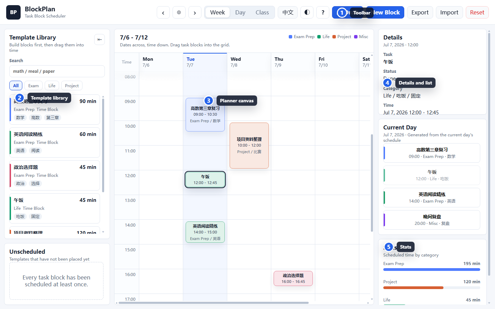

<h1 align="center">BlockPlan</h1>

<p align="center">
  <b>A task-block scheduler: create reusable blocks first, then drag them into your planner.</b>
</p>

<p align="center">
  <a href="README.md">简体中文</a> · English · <a href="docs/USAGE_GUIDE.en.md">Illustrated Guide</a>
</p>

<p align="center">
  <a href="https://github.com/WanderLandWalker/blockplan/releases/latest">
    
  </a>
  <a href="LICENSE">
    
  </a>
  
  
  
  
</p>

<p align="center">
  
</p>

## Why It Exists

Many planning apps can create tasks, calendar events, and reminders. Real planning often needs something more concrete:

| Pain Point | How BlockPlan Helps |
|------------|---------------------|
| To-do lists say what to do, but not when to do it | Drag tasks onto a time grid, so every task gets a start time and duration |
| Calendars are good for fixed events, not reusable study/project/life blocks | Build reusable task templates first, then place them repeatedly |
| Similar tasks require repeated form filling | Keep name, class, tags, color, and duration in the template library |
| Colorful calendars become hard to read | Class/tag drive filtering, stats, and category views |
| Automatic planners can feel heavy or opaque | Start with visible, explainable drag-and-drop planning |

BlockPlan is not just for recording events. It turns a pile of things you need to do into blocks that can be moved, reused, measured, and reviewed.

## What Makes It Different

Sunsama and Akiflow focus on task aggregation and daily planning. Motion and Reclaim focus on automated scheduling for tasks, meetings, and habits. Traditional calendars and to-do apps are great for fixed events, reminders, and simple lists.

BlockPlan is narrower and more direct:

| Area | Common Tools | BlockPlan |
|------|--------------|-----------|
| Starting point | Calendar events or to-do items | Reusable task blocks |
| Scheduling | Create events, fill forms, or let automation decide | Drag templates into time slots |
| Reuse | Copy tasks, repeat rules, hidden templates | The template library is the main interface |
| Category view | Lists, projects, or calendar colors | Class/tag drive filtering, stats, and category view |
| Control | Strong automation, but more rules to manage | Manual drag-and-drop, easy to see what changed |
| Access | Often requires accounts, integrations, or subscriptions | Current version runs locally without an account |

The key idea: you are not just filling a calendar. You are operating your own set of planning blocks.

## Features

| Feature | Description |
|---------|-------------|
| Task block templates | Create reusable tasks with class, tags, color, and default duration |
| Drag-and-drop scheduling | Drag blocks into the calendar to place them on a date and time |
| Week / Day / Class views | Review your plan by time, current day, or category |
| Current-day list | Automatically turns a selected day into an executable task list |
| Conflict hints | Shows when tasks overlap on the same day |
| Task detail cards | Click a scheduled task or day-list item to see full status, time, category, and notes |
| First-run guide | A three-step guide opens on first launch and can be reopened from the top `?` button |
| Bilingual UI | Switch between Chinese and English inside the app |
| Dark mode | Switch between light and dark themes, with your preference saved locally |
| Local-first data | Data stays on your device, with JSON import/export |
| Multi-platform | Web, Windows, and Android builds |

## Download

Download the latest version from [Releases](https://github.com/WanderLandWalker/blockplan/releases/latest).

| File | Best For | Description |
|------|----------|-------------|
| `BlockPlan-0.2.4-windows-setup.exe` | Regular Windows users | Installs BlockPlan so you can launch it from the system |
| `BlockPlan-0.2.4-windows-portable.exe` | No-install usage | Double-click to run without installation |
| `BlockPlan-0.2.4-android-debug.apk` | Android users | Install on an Android phone |
| `BlockPlan-0.2.4-web.zip` | Browser-only usage | Unzip and open `index.html` |

Not sure which one to choose:

- Windows PC: download `windows-setup.exe`.
- Temporary trial: download `windows-portable.exe`.
- Android phone: download `android-debug.apk`.
- No installation: download `web.zip`.

## Illustrated Guide

For step-by-step screenshots, open the [BlockPlan Illustrated Guide](docs/USAGE_GUIDE.en.md).

Quick anchors:

- [Install and choose a build](docs/USAGE_GUIDE.en.md#install-and-choose-a-build)
- [First launch](docs/USAGE_GUIDE.en.md#first-launch)
- [Create task blocks](docs/USAGE_GUIDE.en.md#create-task-blocks)
- [Drag blocks into the planner](docs/USAGE_GUIDE.en.md#drag-blocks-into-the-planner)
- [View task details](docs/USAGE_GUIDE.en.md#view-task-details)
- [Adjust and review tasks](docs/USAGE_GUIDE.en.md#adjust-and-review-tasks)
- [Switch language and theme](docs/USAGE_GUIDE.en.md#switch-language-and-theme)
- [Import and export backups](docs/USAGE_GUIDE.en.md#import-and-export-backups)
- [AI Draft](docs/USAGE_GUIDE.en.md#ai-draft)

## Quick Start

### 1. Create Task Blocks

Click `New Block`, then fill in the name, class, tags, default duration, color, and note. A task block is a reusable planning template.

### 2. Drag Blocks Into The Calendar

Drag a task block from the left template library into the planner grid.

```text
Template: Calculus review, 90 minutes
Drop at: Monday 09:00
Result: Monday 09:00-10:30 has a scheduled Calculus review task
```

### 3. Adjust Scheduled Tasks

Click a scheduled task and use the right detail panel to mark done, split, move earlier/later, resize, postpone, or delete. Clicking the task itself also opens a detail card, which helps with short tasks that cannot show every field inline.

### 4. Switch Views

| View | Use It For |
|------|------------|
| Week | See the whole week's plan |
| Day | Focus on one day's execution list |
| Class | See how time is distributed across categories |

### 5. Back Up Your Data

Use import, export, and reset in the toolbar. Export a JSON backup before clearing browser cache, switching browsers, uninstalling the app, or moving to another device.

## FAQ

### Why does Windows say the publisher is unknown?

The current build is not code-signed yet. If the installer comes from this repository's Release page, you can choose to continue.

### Why does Android block installation?

Android restricts APKs from unknown sources. Temporarily allow your browser or file manager to install the APK.

### Where is my data stored?

Data is stored locally in the browser or app environment. The current version has no account system, no cloud sync, and no backend service.

### What does AI Draft do?

The current AI Draft feature is a local rule-based prototype, not an online model integration. It recognizes keywords such as math, English, politics, review, meal, exercise, and project, plus timing phrases such as tomorrow, morning, afternoon, evening, and 90 minutes, then creates task-block drafts from that description.

## Current Limits

- Mobile works, but touch drag-and-drop still needs deeper optimization.
- Conflict handling is currently a warning, not automatic rescheduling.
- AI task creation is a local rule-based prototype, not a real online model yet.
- Windows and Android builds are not code-signed yet.

## Version History

| Version | Changes |
|---------|---------|
| v0.2.4 | Splits Chinese and English READMEs, adds illustrated guides, MIT license, and in-app first-run guide |
| v0.2.3 | Adds light / dark theme switching, complete dark-mode adaptation, and click-to-view task detail cards |
| v0.2.2 | Fixes scheduled blocks visually covering sticky date headers while scrolling, with clearer layering and a soft top fade |
| v0.2.1 | Adds Chinese / English UI switching, English README content, English AI draft parsing, and clearer user instructions |
| v0.2.0 | First public preview for Web, Windows, and Android with templates, drag-and-drop scheduling, import/export, and conflict hints |

## Support

If BlockPlan helps you turn fuzzy plans into movable, executable, reviewable blocks, a GitHub Star would mean a lot.

<p>
  <a href="https://github.com/WanderLandWalker/blockplan">
    
  </a>
</p>

You can also support the author here:

<p>
  
</p>

## Star History

<p align="center">
  <a href="https://www.star-history.com/#WanderLandWalker/blockplan&Date">
    
  </a>
</p>

## License

BlockPlan is released under the [MIT License](LICENSE).
