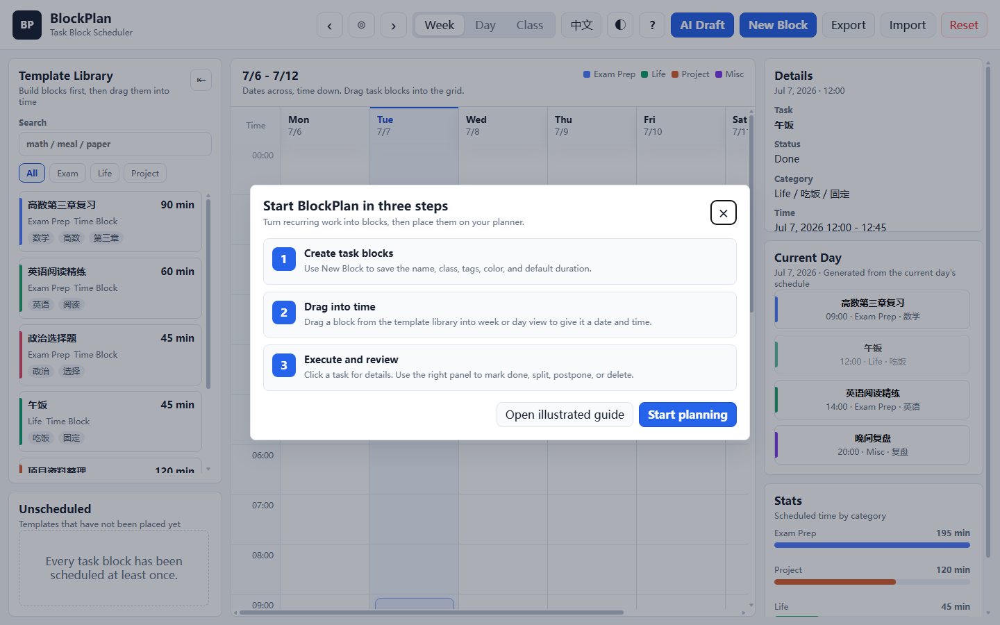
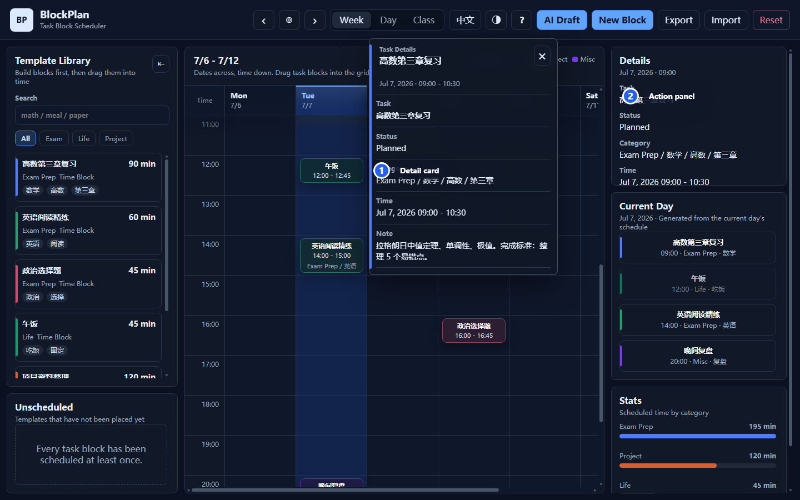

# BlockPlan Illustrated Guide

This guide is for first-time BlockPlan users. Read it in order, or jump straight to a task.

## Quick Links

- [Install and choose a build](#install-and-choose-a-build)
- [First launch](#first-launch)
- [Create task blocks](#create-task-blocks)
- [Drag blocks into the planner](#drag-blocks-into-the-planner)
- [View task details](#view-task-details)
- [Adjust and review tasks](#adjust-and-review-tasks)
- [Switch language and theme](#switch-language-and-theme)
- [Import and export backups](#import-and-export-backups)
- [AI Draft](#ai-draft)

## Interface Overview


1. Top toolbar: change dates, switch views, change language/theme, create blocks, and import/export data.
2. Template library: store reusable task blocks, search, filter, and drag them.
3. Planner canvas: place task blocks on a specific date and time.
4. Details and lists: review the selected task, current-day order, and category stats.
5. Task detail card: click even a short task to see full information.

## Install and choose a build

Open [Releases](https://github.com/WanderLandWalker/blockplan/releases/latest), then choose the file for your device:

| Use Case | Download |
|----------|----------|
| Regular Windows install | `BlockPlan-0.2.4-windows-setup.exe` |
| Portable Windows app | `BlockPlan-0.2.4-windows-portable.exe` |
| Android phone | `BlockPlan-0.2.4-android-debug.apk` |
| Browser-only build | `BlockPlan-0.2.4-web.zip` |

Windows may warn that the publisher is unknown because the app is not code-signed yet. Android may ask you to allow installation from your browser or file manager.

## First launch



On first launch, BlockPlan shows a three-step guide:

1. Create task blocks.
2. Drag blocks into the planner.
3. Click tasks to execute, adjust, and review.

After closing it once, it will not keep appearing. You can reopen it later from the top `?` button.

## Create task blocks

Click `New Block`, then fill in a task template:

| Field | Suggestion |
|-------|------------|
| Name | Use an actionable name, such as "English reading" or "Project research" |
| Class | Use broad categories such as "Exam", "Life", or "Project" |
| Subclass / tags | Use finer labels such as "math", "reading", or "review" |
| Default duration | How long the task usually takes, such as 30 / 60 / 90 minutes |
| Color | Helps identify the task quickly in the planner |
| Note | Materials, goals, completion standard, or reminders |

Task blocks are templates. Deleting a scheduled instance does not delete the original template.

## Drag blocks into the planner

Hold a task block in the left template library, drag it onto a date and time in the planner canvas, then release.

```text
Template: Calculus chapter review, 90 minutes
Drop at: Monday 09:00
Result: Monday 09:00-10:30 now has a scheduled review task
```

If tasks overlap, BlockPlan shows a conflict hint. It is a warning only; your tasks are not automatically deleted or rearranged.

## View task details



Short task cards may only show name and time. Click a scheduled task or a current-day list item to open a detail card with:

- Status
- Class and tags
- Full date and time
- Conflict hints
- Notes

The detail card is for viewing. Use the right detail panel to edit or adjust the task.

## Adjust and review tasks

After selecting a task, the right detail panel shows action buttons:

| Action | Effect |
|--------|--------|
| Mark done / undone | Record whether the task was completed |
| Split | Split a long task into two blocks |
| Earlier / Later | Move the start time |
| Shorter / Longer | Change duration |
| Postpone | Move the task to the same time tomorrow |
| Delete | Remove this scheduled instance without deleting the template |

The current-day list automatically sorts the selected day's tasks by time. Stats summarize scheduled time by category.

## Switch language and theme

The top toolbar has two preference controls:

- `EN` / `中文`: switch between Chinese and English.
- `◐` / `◑`: switch between light and dark mode.

Language and theme are saved locally. User-created task names, notes, and tags are not auto-translated, so your original data stays unchanged.

## Import and export backups

The toolbar has three data buttons:

| Button | Purpose |
|--------|---------|
| Export | Save current task blocks and schedules as a JSON file |
| Import | Restore data from a JSON file |
| Reset | Clear current data and restore default examples |

Export a JSON backup before clearing browser cache, switching browsers, uninstalling the app, or moving to another device.

## AI Draft

Click `AI Draft`, then enter a natural-language description:

```text
Tomorrow morning, schedule a 90-minute calculus review; in the afternoon, schedule 60 minutes of English reading; reserve 30 minutes for evening review.
```

The current version uses local rule parsing, not an online model. It recognizes common keywords and time phrases, then creates task blocks and schedule drafts. Treat it as a fast input helper rather than full automatic scheduling.
