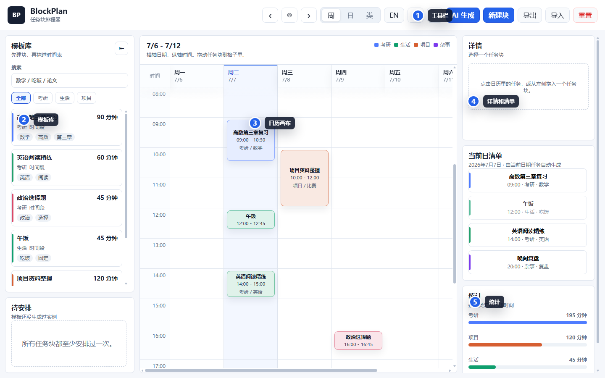
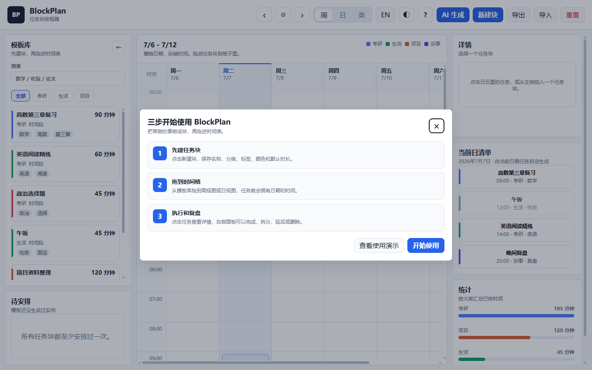
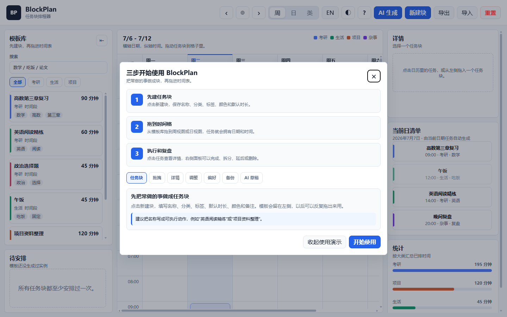
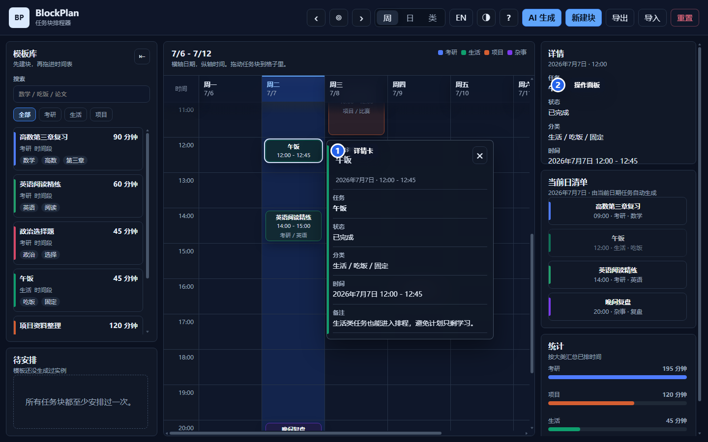

# BlockPlan 图解指南

这份指南适合第一次使用 BlockPlan 的用户。你可以按顺序看，也可以直接跳到某个操作。

## 快速定位

- [安装和选择版本](#安装和选择版本)
- [第一次打开](#第一次打开)
- [创建任务块](#创建任务块)
- [拖拽排程](#拖拽排程)
- [查看任务详情](#查看任务详情)
- [调整和复盘任务](#调整和复盘任务)
- [切换语言和主题](#切换语言和主题)
- [导入导出备份](#导入导出备份)
- [AI 生成草稿](#ai-生成草稿)

## 界面总览



1. 顶部工具栏：切换日期、视图、语言、主题，创建任务块，导入导出数据。
2. 模板库：保存可复用任务块，可以搜索、筛选和拖拽。
3. 日历画布：把任务块放到具体日期和时间。
4. 详情和清单：查看当前任务详情、当天任务顺序和统计。
5. 任务详情卡：点击短任务也能看到完整信息。

## 安装和选择版本

打开 [Releases](https://github.com/WanderLandWalker/blockplan/releases/latest)，按设备选择：

| 你想怎么用 | 下载 |
|------------|------|
| Windows 正常安装 | `BlockPlan-0.2.5-windows-setup.exe` |
| Windows 免安装 | `BlockPlan-0.2.5-windows-portable.exe` |
| Android 手机 | `BlockPlan-0.2.5-android-debug.apk` |
| 浏览器打开 | `BlockPlan-0.2.5-web.zip` |

Windows 如果提示未知发布者，确认文件来自本仓库 Release 后可以继续运行。Android 如果提示禁止安装，需要临时允许当前浏览器或文件管理器安装未知来源应用。

## 第一次打开



第一次打开时，BlockPlan 会显示三步引导：

1. 先建任务块。
2. 把任务块拖进时间表。
3. 点击任务执行、调整和复盘。

关闭后不会反复弹出。以后想重新查看，可以点击顶部工具栏的 `?`。点击弹窗里的“查看使用演示”会在当前弹窗内展开完整操作目录，不会跳出软件或打断当前计划。



## 创建任务块

点击顶部 `新建块`，填写任务模板：

| 字段 | 建议 |
|------|------|
| 名称 | 写成可执行动作，例如“英语阅读精练”“项目资料整理” |
| 大类 | 用来区分方向，例如“考研”“生活”“项目” |
| 子类 / tag | 用来细分内容，例如“数学”“阅读”“复盘” |
| 默认时长 | 这个任务通常需要多久，例如 30 / 60 / 90 分钟 |
| 颜色 | 用来在日历中快速识别 |
| 备注 | 写目标、材料、完成标准或注意事项 |

任务块是模板。删除一次排程不会删除模板，后面还能继续拖出来用。

## 拖拽排程

在左侧模板库按住任务块，拖到中间日历画布的某一天、某个时间段，然后松手。

```text
模板：高数第三章复习，默认 90 分钟
拖到：周一 09:00
结果：周一 09:00-10:30 出现一个高数复习任务
```

如果任务之间时间重叠，系统会显示冲突提示。冲突只是提醒，不会自动删除或重排你的任务。

## 查看任务详情



日历里的短任务可能只显示名称和时间。点击任务块或右侧当前日清单里的任务，会弹出详情卡，显示：

- 状态
- 分类和标签
- 完整日期和时间
- 冲突提示
- 备注

详情卡只负责查看。如果要修改任务，继续使用右侧详情面板里的操作按钮。

## 调整和复盘任务

点击任务后，右侧详情面板会出现操作按钮：

| 操作 | 作用 |
|------|------|
| 标为完成 / 标为未完成 | 记录任务是否做完 |
| 拆成两块 | 把较长任务拆成两段 |
| 提前 / 延后 | 调整开始时间 |
| 缩短 / 延长 | 调整任务时长 |
| 推迟一天 | 把任务移到明天同一时间 |
| 删除 | 删除这一次安排，不影响原模板 |

右侧“当前日清单”会自动按时间整理当前日期的任务；“统计”会按大类汇总已排时间。

## 切换语言和主题

顶部工具栏提供两个偏好设置：

- `EN` / `中文`：切换中文和英文界面。
- `◐` / `◑`：切换浅色和深色模式。

语言和主题都会保存在本机。你自己创建的任务名称、备注和标签不会被自动翻译，避免改动原始数据。

## 导入导出备份

工具栏里有三个数据按钮：

| 按钮 | 用途 |
|------|------|
| 导出 | 把当前任务块和排程保存成 JSON 文件 |
| 导入 | 从 JSON 文件恢复数据 |
| 重置 | 清空当前数据并恢复默认示例 |

清浏览器缓存、换浏览器、卸载应用或换设备前，请先导出 JSON。

## AI 生成草稿

点击 `AI 生成` 后，输入一段自然语言描述，例如：

```text
明天上午安排高数第三章复习 90 分钟，下午安排英语阅读 60 分钟，晚上留 30 分钟复盘。
```

当前版本使用本地规则解析，不会调用在线大模型。它会识别常见关键词和时间表达，然后创建任务块和排程草稿。你可以把它当作快速录入入口，而不是完全自动排程。
